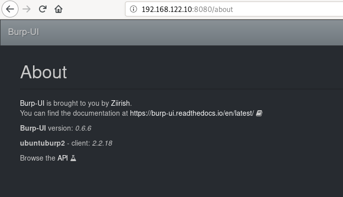
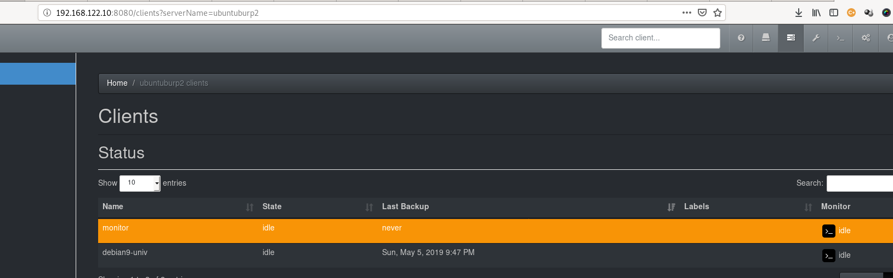
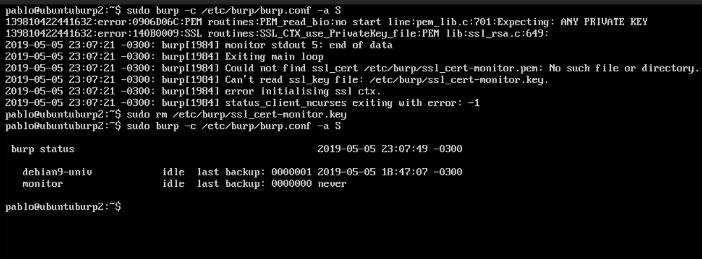

# Ansible burp backup and restore suite quickstart

## Before starting

---

You must understand the basic configuration required for burp backup and restore.

On server, it will setup a:

    /etc/burp/burp-server.conf
    With all the configuration required

    /etc/burp/clientconfdir/clientname
    With each client you add to be authorized on server. Based on the vars used to add clients.

    /etc/burp/clientconfdir/incexc
    The role will add some templates here.

On client, it will:

    /etc/burp/burp.conf
    A configuration based on burp_client role, pointing to server name and server IP.

### Burpui - Additional setup on burp server

On server, you have option to add burpui_agent, when using multi-agent module.

    /etc/burp/buiagent.cfg
    With settings based on burpui_agent role.

### Burpui - burpui-server

You can run it on stand alone or multi-agent.

    /etc/burp/burpui.cfg
    Settings for your burpui server

    /etc/burp/burp-reports.cfg
    This is added by burp-reports role, with settings done with its role.

## Example architecture

---

This example adds 2 HOST in [production.ini](inventory/production.ini)

As you will see, it adds also two groups:

    [burp2_servers]

All hosts names in here will run burp2_server roles and if you want by default also burpui-agent role. See [roles.burp2_servers.yml](roles.burp2_servers.yml)

    [burpui_servers]

All hosts here will run the burpui role and burp-reports role. See [roles.burp2_servers.yml](roles.burp2_servers.yml)

Then all hosts except those in group `burp2_servers` will run the burp2_client role, to have backups directly on the burp2 server created. See [roles.common_backups.yml](roles.common_backups.yml)

## Start preparing the ansible inventory and vars

You will need to copy the entire [quickstart](../quickstart) folder and then modify the files.

### Inventory

Modify the [production.ini](inventory/production.ini)

### Group vars for clients

Modify [inventory/group_vars/all/burp_vars_all.yml](inventory/group_vars/all/burp_vars_all.yml)

    Here you add the IP and hostname of the burp_server for your clients.
    Also the password that should match the password you also use in /etc/burp/clientconfdir/clientname and on client.

Modify [inventory/host_vars/ubuntuburp2/ubuntuburp2.yml](inventory/host_vars/ubuntuburp2/ubuntuburp2.yml)

    In this case we use UBUNTUBURP2 as our unique burp2 server HOSTNAME, if you use different name, you will need to rename this dir.
    Here I use the var to add my clients burp2_add_manual_clients and also the profile used for this client.

The profiles I use are the defaults in the role, but you can modify them using **group_vars/burp2_servers**

## Burp-ui Vars

All the above if for burp-server and burp-client only, now I will prepare some vars for burp-ui, burpui-agent and burp-reports.

### Burp-ui server

Main file for our own vars: [inventory/group_vars/burpui_servers/burpui_servers.yml](inventory/group_vars/burpui_servers/burpui_servers.yml)

Here I setup the burpui server as **multi-agent**

```yaml
burpui_standalone: False
```

You can change it to True if you want to use the same burpui server as the burp-server.

Then there are others vars you will need to setup for agents and user/password for burp-ui.

Also [inventory/group_vars/burp2_servers/burpui_agent.yml](inventory/group_vars/burp2_servers/burpui_agent.yml) Will be used to add the password for the agent side (should be the same as set in the burp-ui server side for the agent to connect ofcourse)

You can use this structure to add more customization, just see the defaults of each role and add them here.

### Burp-repors

Vars in: [inventory/group_vars/burpui_servers/burp_resports.yml](inventory/group_vars/burpui_servers/burp_reports.yml)

There are more vars than the ones shown here, see the defaults in the role. (see the link in each vars file.)

## Installing the dependencies

---

Update the versions (if required) in [requirements.yml](requirements.yml)  (See this file for more details about versions and compatibility with different burp versions)

To update/downgrade a version you can remove the dir for the role to update in `~/.ansible/roles/` or directly in `roles` dir.

Install the requirements:

```shell
ansible-galaxy install -r requirements.yml
```

Once you have all your customizations done, you can run the playbook using the [site.yml](site.yml).

**Note**: For debian9 I have installed sudo and added my account to sudo group.

```shell
ansible-playbook site.yml --inventory inventory/production.ini -u username -k -K

--- lines omitted ---

PLAY RECAP ***************************************************************************************************************************************************
debian9-univ               : ok=80   changed=0    unreachable=0    failed=0   
ubuntuburp2                : ok=52   changed=3    unreachable=0    failed=0   

```

You can then connect to each server and see the functionality.

Example client on `debian9-univ`:

```shell
pablo@debian9-univ:~$ sudo burp -a l
[sudo] password for pablo: 
2019-05-05 22:41:06 -0300: burp[28434] Connecting to 192.168.122.135:4977
2019-05-05 22:41:06 -0300: burp[28434] auth ok
2019-05-05 22:41:06 -0300: burp[28434] Server version: 2.2.18
2019-05-05 22:41:06 -0300: burp[28434] nocsr ok
2019-05-05 22:41:06 -0300: burp[28434] SSL is using cipher: DHE-RSA-AES256-GCM-SHA384 TLSv1.2 Kx=DH       Au=RSA  Enc=AESGCM(256) Mac=AEAD

2019-05-05 22:41:06 -0300: burp[28434] extra_comms_begin ok:autoupgrade:incexc:orig_client:uname:sincexc:counters_json:msg:forceproto=1:
2019-05-05 22:41:06 -0300: burp[28434] Server is forcing protocol 1
Backup: 0000001 2019-05-05 18:47:07 -0300 (deletable)
2019-05-05 22:41:06 -0300: burp[28434] main socket 3: Peer closed SSL session
2019-05-05 22:41:06 -0300: burp[28434] List finished ok
```

Example burpui about:



Clients on server:



Troubleshooting some problems with cert on monitor client on burp server (this shouldn't happen but I had this issue while writing this quickstart):


